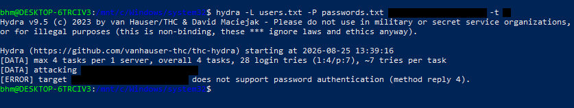
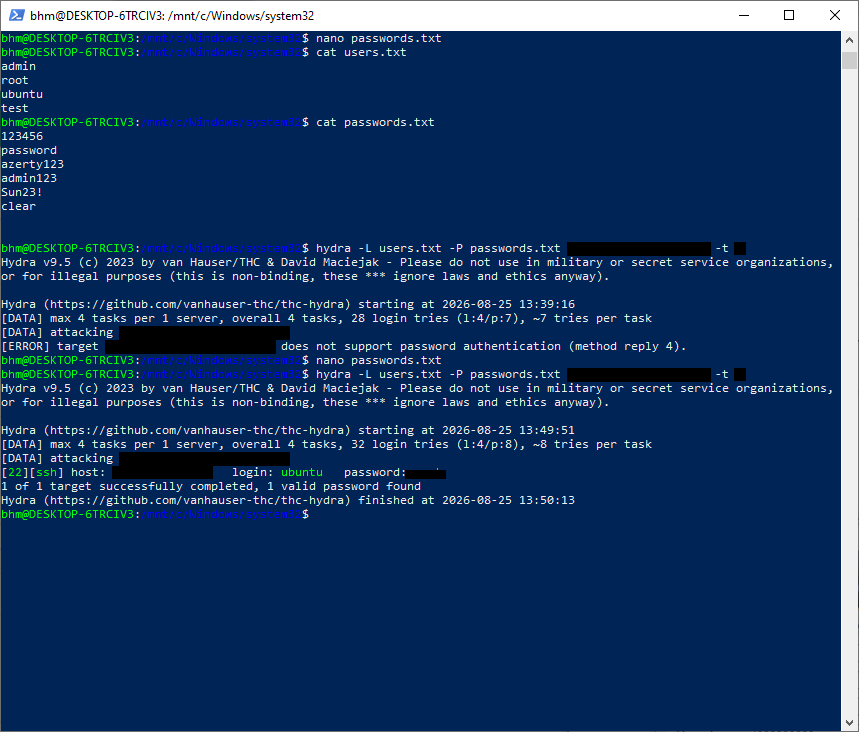
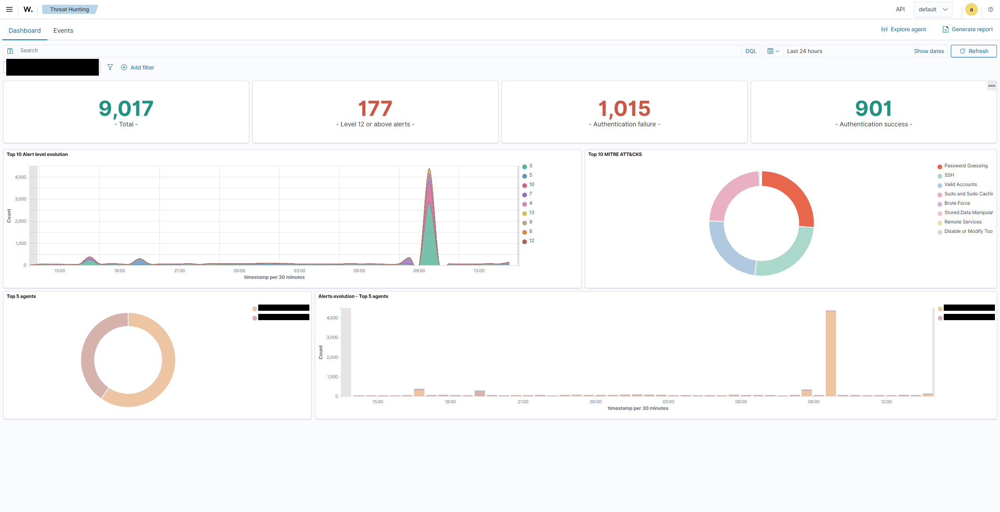
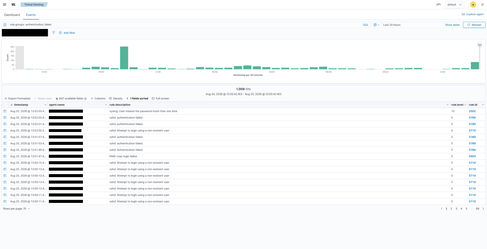

# Home-Lab SOC — Déploiement Wazuh sur Oracle Cloud & Tests de détection

## Contexte

Dans le cadre de la préparation d'un profil SOC/Blue Team, ce projet consiste à déployer un SIEM Wazuh self-hosted et à valider ses capacités de détection via des scénarios d'attaque contrôlés.

## Architecture

| Composant | Rôle | OS |
|---|---|---|
| Instance A (manager) | Wazuh Manager + Indexer + Dashboard | Ubuntu 22.04 (Oracle Cloud Free Tier) |
| Instance B (endpoint) | Agent Wazuh surveillé | Ubuntu 22.04 (Oracle Cloud Free Tier) |

- Réseau : VCN dédié, subnet public, Security Lists OCI + règles iptables locales restreignant les ports exposés (22, 443, 1514/tcp+udp, 1515, 55000)
- Agent Wazuh connecté au manager, ID `001`, statut actif
- Dashboard accessible via HTTPS, authentification par compte admin

> Les adresses IP publiques et identifiants ont été retirés/anonymisés dans cette publication.

## Déploiement automatique

Ce dépôt fournit tout le nécessaire pour redéployer ce lab (infrastructure
+ manager + agent) sur **votre propre compte cloud**, avec **vos propres
identifiants**. Aucune information personnelle n'est codée en dur : tout se
configure via des fichiers locaux ignorés par git.

### Option A — vous avez déjà deux VM

```bash
git clone https://github.com/Nappyboy23/soc-homelab-wazuh.git
cd soc-homelab-wazuh
cp config/deploy.env.example config/deploy.env
$EDITOR config/deploy.env      # vos IP, clés SSH, IP admin autorisée...
./deploy.sh
```

### Option B — partir de zéro sur Oracle Cloud (Terraform)

Un module Terraform (`terraform/oci/`) provisionne l'infrastructure
elle-même (VCN, subnet, groupes de sécurité, les deux instances Ubuntu en
Always Free Tier), puis vous enchaînez avec `./deploy.sh` :

```bash
cd terraform/oci
cp terraform.tfvars.example terraform.tfvars
$EDITOR terraform.tfvars       # vos identifiants OCI
terraform init && terraform apply
```

Guide détaillé : **[terraform/oci/README.md](terraform/oci/README.md)**.

---

Dans les deux cas, `deploy.sh` installe Wazuh (manager+indexer+dashboard)
sur la première machine, l'agent sur la seconde, les enrôle l'un à l'autre,
puis restreint les ports exposés. Les identifiants du dashboard sont
générés aléatoirement par l'installeur officiel Wazuh — ils ne sont ni
choisis, ni transmis, ni stockés par ce projet.

Guide détaillé, prérequis et dépannage : **[docs/DEPLOY.md](docs/DEPLOY.md)**.

Les scripts d'installation peuvent aussi être exécutés indépendamment,
directement sur chaque machine (voir `docs/DEPLOY.md`) si vous préférez ne
pas orchestrer depuis votre poste.

## Scénario 1 — Reconnaissance réseau (Nmap)

**Objectif** : vérifier la visibilité d'un scan de reconnaissance dans les logs système, et comprendre pourquoi un scan simple ne déclenche pas nécessairement une alerte Wazuh.

**Commande exécutée** (depuis un poste externe) :
```bash
nmap -sV -Pn <IP_endpoint>
```

**Résultat** :
- Trace confirmée côté serveur dans `journalctl -u ssh` : `Connection closed by <IP_source>`
- **Aucune alerte Wazuh déclenchée**

**Analyse** : un scan de version (`-sV`) sans tentative d'authentification n'atteint pas le seuil de détection des règles SSH par défaut de Wazuh, qui se concentrent sur les échecs d'authentification et les patterns de connexion répétés. Ce comportement est normal et attendu — il illustre une limite importante à documenter : **la détection réseau pure (scan de ports) nécessite des règles dédiées ou un IDS complémentaire (ex: Suricata) pour être visible**, un scan Nmap léger seul ne suffit pas à générer une alerte SIEM basée sur les logs d'authentification.

## Scénario 2 — Brute-force SSH (Hydra)

### Étape 1 — Constat initial : authentification par mot de passe désactivée

Première tentative de brute-force refusée nativement par le serveur :

```
[ERROR] target ssh://<IP_endpoint>:22/ does not support password authentication (method reply 4)
```

**Cause identifiée** : la configuration cloud-init Ubuntu/Oracle Cloud impose `PasswordAuthentication no` via un fichier drop-in (`/etc/ssh/sshd_config.d/60-cloudimg-settings.conf`), qui prime sur `sshd_config` principal. Ce point mérite d'être documenté en tant que résultat en soi : **la configuration par défaut du serveur est déjà durcie contre le brute-force par mot de passe** (authentification par clé uniquement).

### Étape 2 — Test contrôlé avec authentification par mot de passe temporairement réactivée

Pour valider la capacité de détection de Wazuh sur ce type d'attaque, l'authentification par mot de passe a été **temporairement réactivée** sur l'agent, un compte de test doté d'un mot de passe a été configuré, puis la configuration a été restaurée immédiatement après le test.

**Commande Hydra** :
```bash
hydra -L users.txt -P passwords.txt ssh://<IP_endpoint> -t 4
```

- Liste d'utilisateurs de test : `admin`, `root`, `ubuntu`, `test`
- Liste de mots de passe de test : quelques valeurs communes + 1 valeur valide
- 32 combinaisons testées, 4 threads parallèles

**Résultat Hydra** :
```
[22][ssh] host: <IP_endpoint>   login: ubuntu   password: ******
1 of 1 target successfully completed, 1 valid password found
```


*Premier essai : le serveur refuse toute tentative par mot de passe (`PasswordAuthentication no` actif).*


*Après réactivation contrôlée de l'authentification par mot de passe : 32 combinaisons testées, 1 valide trouvée.*

### Détection côté Wazuh

Recherche filtrée sur `rule.groups: authentication_failed` (fenêtre 24h) : **1 008 événements** générés par le test.

| Rule ID | Description | Niveau |
|---|---|---|
| 5710 | sshd: Attempt to login using a non-existent user | 5 |
| 5760 | sshd: authentication failed | 5 |
| 5503 | PAM: User login failed | 5 |
| **2502** | **syslog: User missed the password more than one time** | **10** |

La règle **2502** est la plus significative : elle démontre que Wazuh ne se contente pas de logger des échecs individuels, mais **corrèle plusieurs échecs consécutifs en un pattern de brute-force**, remontant le niveau de sévérité de 5 à 10.


*901 authentifications réussies, 1015 échecs sur 24h, avec pic net au moment du test. Techniques MITRE ATT&CK identifiées : Brute Force, Password Guessing, Valid Accounts, SSH.*


*1008 événements filtrés sur `rule.groups: authentication_failed`, avec detail des rule.id (5710, 5760, 5503, 2502).*

Vue MITRE ATT&CK associée (module Threat Hunting) : les techniques **Brute Force**, **Password Guessing**, **Valid Accounts** et **SSH** ont été automatiquement mappées à partir des événements générés.

### Remédiation post-test

Une fois le test validé :
1. `PasswordAuthentication no` restauré dans `/etc/ssh/sshd_config.d/60-cloudimg-settings.conf`
2. Service SSH redémarré (`systemctl restart ssh`)
3. Mot de passe du compte de test modifié/compte désactivé

## Enseignements clés

- Un durcissement par défaut (auth par clé uniquement) peut masquer une capacité de détection tant qu'elle n'est pas testée dans des conditions dégradées — il est utile de documenter les deux états (protégé / dégradé) plutôt qu'un seul scénario.
- La détection Wazuh SSH repose sur la corrélation d'échecs d'authentification (decoders syslog/sshd + règle de seuil), pas sur l'inspection réseau brute — un scan de reconnaissance seul ne suffit pas à générer une alerte.
- Toute modification de sécurité effectuée à des fins de test (ex: réactivation temporaire de `PasswordAuthentication`) doit être **strictement encadrée, limitée dans le temps et annulée immédiatement après**, y compris en environnement de lab isolé.

## Prochaines étapes

- Test de détection malware (indicateurs de compromission)
- Étude de règles complémentaires pour la détection de scans réseau (intégration Suricata ou règle personnalisée sur volume de connexions SYN)
- Scripts opt-in pour rejouer les scénarios 1 et 2 de façon encadrée (voir `docs/DEPLOY.md` — Roadmap)
- ~~Module Terraform pour provisionner aussi les deux VM (OCI)~~ ✅ voir `terraform/oci/`
